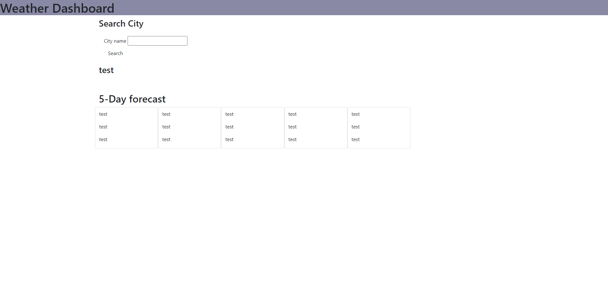

# Weather-App

## Technology Used

| Technology Used |                                                    Resource URL                                                    |
| --------------- | :----------------------------------------------------------------------------------------------------------------: |
| HTML            |       [https://developer.mozilla.org/en-US/docs/Web/HTML](https://developer.mozilla.org/en-US/docs/Web/HTML)       |
| CSS             |        [https://developer.mozilla.org/en-US/docs/Web/CSS](https://developer.mozilla.org/en-US/docs/Web/CSS)        |
| Git             |                                    [https://git-scm.com/](https://git-scm.com/)                                    |
| JavaScript      | [https://developer.mozilla.org/en-US/docs/Web/JavaScript](https://developer.mozilla.org/en-US/docs/Web/JavaScript) |

## Description

[Visit the Deployed Site]()

## Usage

## Learning Points

I didnt get to finish this homework unfortuntly.
however I was able to get the data that I needed from the api's I just had a very tough time appending them to the page. I will be fixing the code in the coming days to append.

## Author Info

- [LinkedIn](https://www.linkedin.com/in/jarell-chinn-517307220/)
- [Github](https://github.com/Jarell-Chinn)
